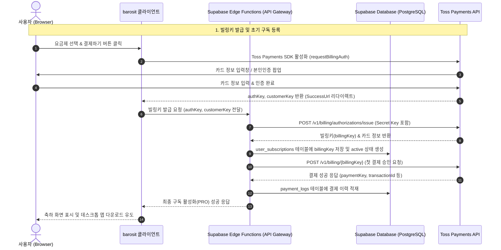
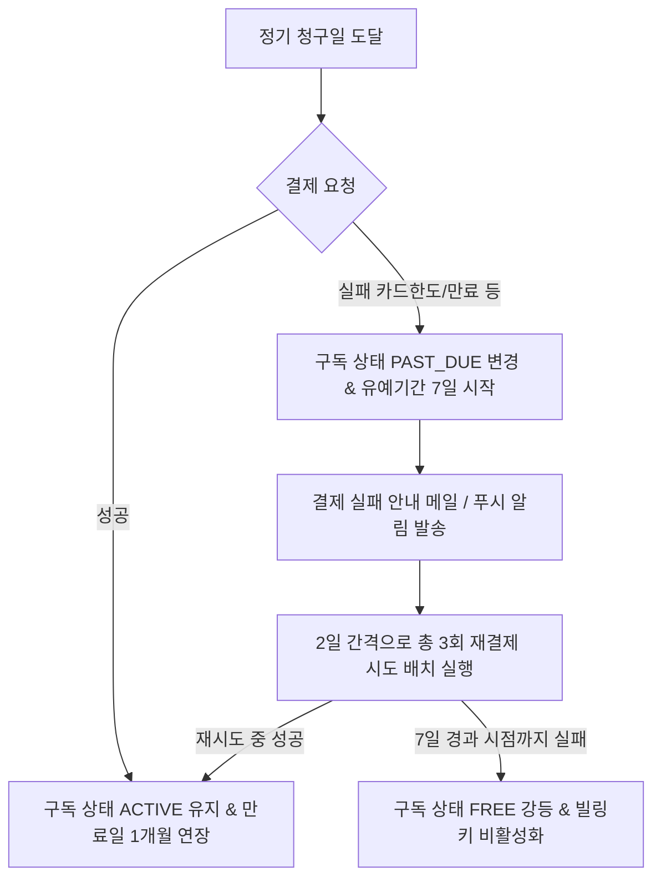

# Toss Payments Billing & Subscription Integration Specification (상용 결제 연동 사양서)

본 문서는 **BaroSit** 서비스의 상용 결제 환경 구축을 위한 기술 사양서입니다. 사용자가 카드를 등록하고 정기적으로 자동 결제가 수행되는 **빌링(Billing) 및 구독(Subscription) 아키텍처**를 다루며, 프론트엔드, Supabase Edge Functions(보안 중계 서버), 그리고 Toss Payments API 간의 보안 협업 시나리오를 정의합니다.

---

## 1. 아키텍처 개요 (Architecture Overview)

정기 구독 서비스는 클라이언트 단에서 직접 Toss Payments Secret Key를 다룰 수 없으므로, **2-Way Handshake** 방식의 보안 연동을 수행합니다. 결제 승인 및 취소 처리는 백엔드(Supabase Edge Functions)에서 중계하며, 결제 이탈 및 비정상 종료를 방지하기 위해 **Toss Webhook 수신부**와 **더닝(Dunning) 스케줄러**가 유기적으로 맞물려 동작합니다.



---

## 2. 데이터베이스 스키마 설계 (Database Schema)

구독 상태 및 결제 이력, 빌링키 보안 관리를 위해 Supabase PostgreSQL에 아래 스키마를 구성합니다.

### 2.1. `user_subscriptions` (사용자 구독 상태 테이블)
| 컬럼명 | 타입 | 제약조건 | 설명 |
| :--- | :--- | :--- | :--- |
| `user_id` | `uuid` | Primary Key, FK (auth.users) | 사용자 고유 ID |
| `plan_id` | `varchar(32)` | NOT NULL | 구독 플랜 (`pro`, `free`) |
| `status` | `varchar(32)` | NOT NULL | 구독 상태 (`active`, `canceled`, `past_due`, `none`) |
| `billing_key` | `varchar(255)` | Nullable, Encrypted | 토스 정기 자동 결제 빌링키 |
| `current_period_start` | `timestamptz` | NOT NULL | 현재 결제 주기 시작일 |
| `current_period_end` | `timestamptz` | NOT NULL | 현재 결제 주기 만료일 (다음 청구 시점) |
| `canceled_at` | `timestamptz` | Nullable | 구독 해지 예약 신청 시각 |
| `created_at` | `timestamptz` | DEFAULT now() | 생성 시각 |
| `updated_at` | `timestamptz` | DEFAULT now() | 수정 시각 |

### 2.2. `payment_logs` (결제 원장 및 이력 테이블)
| 컬럼명 | 타입 | 제약조건 | 설명 |
| :--- | :--- | :--- | :--- |
| `id` | `uuid` | Primary Key, DEFAULT gen_random_uuid() | 결제 이력 고유 ID |
| `user_id` | `uuid` | FK (auth.users) | 사용자 고유 ID |
| `order_id` | `varchar(100)` | UNIQUE | 가맹점 주문 번호 |
| `payment_key` | `varchar(100)` | NOT NULL | 토스페이먼츠 고유 결제 키 |
| `amount` | `numeric` | NOT NULL | 결제 금액 |
| `billing_cycle` | `varchar(20)` | NOT NULL | 청구 주기 (`monthly`, `yearly`) |
| `status` | `varchar(32)` | NOT NULL | 결제 상태 (`CONFIRMED`, `CANCELED`, `FAILED`) |
| `raw_response` | `jsonb` | Nullable | 토스 API 응답 원본 (디버깅용) |
| `created_at` | `timestamptz` | DEFAULT now() | 결제 완료/기록 시각 |

---

## 3. Toss Payments Billing API 세부 연동 규격

### 3.1. [프론트엔드] 정기 결제 인증 요청 (`requestBillingAuth`)
사용자로부터 카드 정보를 안전하게 입력받고 본인인증을 수행하기 위해 토스 클라이언트 SDK를 실행합니다.

```javascript
import { loadTossPayments } from "@tosspayments/payment-sdk";

async function registerBillingCard(userEmail, billingCycle) {
  const tossPayments = await loadTossPayments("test_ck_D5GePWvyJnrK0W0k6q8gLzN97Eoq");
  const customerKey = `cust-${Math.random().toString(36).substring(2, 12)}`; // 유저 고유 비식별 키

  await tossPayments.requestBillingAuth("카드", {
    customerKey,
    successUrl: `${window.location.origin}/#/pricing?payment=success&cycle=${billingCycle}`,
    failUrl: `${window.location.origin}/#/pricing?payment=fail`,
  });
}
```

### 3.2. [Edge Function] 빌링키 발급 및 구독 저장 (`POST /billing/issue`)
성공 리다이렉트 시 클라이언트가 전달받은 `authKey`와 `customerKey`를 Edge Function에 중계하여 실제 정기 결제에 사용할 1-Way 빌링키를 발급받습니다.

- **Request Endpoint**: `https://<supabase-project>.supabase.co/functions/v1/billing/issue`
- **Toss API Call**: `POST https://api.tosspayments.com/v1/billing/authorizations/issue`
- **Request Headers**:
  - `Authorization: Basic <Base64(Toss_Secret_Key:)>`
  - `Content-Type: application/json`
- **Request Body**:
  ```json
  {
    "authKey": "bln_lM2Dkv12z...",
    "customerKey": "cust-a8f103b4..."
  }
  ```
- **Response Body (Toss -> Edge Function)**:
  ```json
  {
    "billingKey": "sec_billing_key_xxxxxxx",
    "customerKey": "cust-a8f103b4...",
    "card": {
      "company": "신한",
      "number": "433012******1234",
      "cardType": "신용",
      "ownerType": "개인"
    },
    "authenticatedOn": "2026-05-21T23:10:00+09:00"
  }
  ```

### 3.3. [Edge Function] 빌링키를 통한 실결제 승인 (`POST /billing/charge`)
발급된 `billingKey`를 기반으로 정기 결제 주기(월 4,900원 / 연 36,000원)에 맞춰 즉시 1차 결제를 청구하거나 배치 잡을 통해 정기 청구합니다.

- **Request Endpoint**: `https://api.tosspayments.com/v1/billing/{billingKey}`
- **Request Body**:
  ```json
  {
    "customerKey": "cust-a8f103b4...",
    "amount": 4900,
    "orderId": "order-1779369042529",
    "orderName": "BaroSit PRO 월간 구독",
    "customerEmail": "user@barosit.com"
  }
  ```
- **Response Body**:
  ```json
  {
    "paymentKey": "pay_payment_key_yyyyyyy",
    "orderId": "order-1779369042529",
    "orderName": "BaroSit PRO 월간 구독",
    "method": "카드",
    "totalAmount": 4900,
    "status": "DONE",
    "approvedAt": "2026-05-21T23:10:05+09:00",
    "card": {
      "company": "신한",
      "number": "433012******1234"
    }
  }
  ```

---

## 4. 환불 및 결제 취소 API 스펙 (Cancellation & Refund)

사용자가 구독 일자 기점 7일 이내에 환불을 요청한 경우, 혹은 관리자가 강제 환불을 집행하는 경우, Supabase Edge Function을 경유하여 토스 결제 취소 API를 트리거합니다.

- **Request Endpoint (Edge Function)**: `POST https://<supabase-project>.supabase.co/functions/v1/payment/cancel`
- **Toss API Call**: `POST https://api.tosspayments.com/v1/payments/{paymentKey}/cancel`
- **Authorization**: Supabase User Bearer Token (JWT) 검증을 거친 후 백엔드 Secret Key 주입
- **Request Body**:
  ```json
  {
    "paymentKey": "pay_payment_key_yyyyyyy",
    "cancelReason": "고객 변심 및 7일 이내 전액 환불 요청",
    "cancelAmount": 4900
  }
  ```
- **DB Sync Flow**:
  1. JWT 토큰을 해석하여 요청 유저가 해당 `paymentKey`를 소유하고 있는지 `payment_logs` 테이블 조회 검증.
  2. Toss API 호출 후 성공적으로 `CANCELED` 응답을 수신하면, `payment_logs` 상태를 `CANCELED`로 업데이트.
  3. `user_subscriptions` 테이블의 `status`를 `none` (또는 `free` 강등)으로 즉각 격하 처리.

---

## 5. 결제 웹훅(Webhook) 수신 아키텍처

클라이언트 브라우저 이탈(창 닫기, 네트워크 단절 등)로 인해 프론트엔드 successUrl 핸들러가 유실되더라도 DB 상태를 무결하게 동기화하기 위한 이벤트 웹훅 수신부를 구축합니다.

### 5.1. 수신 가능한 웹훅 이벤트 목록
- `PAYMENT_STATUS_CHANGED`: 결제 상태가 변동되었을 때 (가상계좌 입금 완료 등)
- `BILLING_KEY_ISSUED`: 빌링키 발급이 최종적으로 백엔드 측에 통지되었을 때

### 5.2. 웹훅 검증 & 안전망 시나리오
1. **IP & Signature Validation**: Toss Payments 가이드에 의거, Webhook 헤더에 포함된 `Toss-Payments-Signature` 값을 검증하거나 토스 웹훅 발송용 공인 IP 대역을 필터링하여 위조 요청을 원천 차단합니다.
2. **멱등성(Idempotency) 보장**: 동일 결제 원장에 대해 중복 처리되지 않도록 `order_id`와 `payment_key`에 고유 인덱스를 구성하고, `upsert` 구문으로 원장 중복 유입을 방지합니다.

---

## 6. 더닝 프로세스 (Dunning Flow) 및 스케줄러 설계

결제 잔액 부족, 카드 분실/만료 등으로 인해 주기적인 정기 결제가 실패할 경우, 구독 권한을 즉각 박탈하지 않고 **유예 기간(Grace Period)**을 주는 더닝 스케줄러 시나리오입니다.



### 6.1. 백엔드 배치 스케줄러 상세 (Supabase pg_cron)
1. **매일 새벽 03:00 정기 청구 배치 실행**:
   ```sql
   -- pg_cron을 이용해 매일 current_period_end가 도래한 활성 구독자를 대상으로 정기 자동 결제 트리거 Edge Function 호출
   SELECT cron.schedule(
     'daily-billing-dunning-job',
     '0 3 * * *',
     $$ SELECT net.http_post('https://<supabase-project>.supabase.co/functions/v1/cron/charge-renewals', '{}') $$
   );
   ```
2. **Edge Function 내부 로직**:
   - `status = 'active'` 또는 `'past_due'`이고 `current_period_end <= now()`인 사용자를 조회합니다.
   - 각 대상의 `billing_key`를 추출하여 `POST /v1/billing/{billingKey}` API로 정기 결제금을 청구합니다.
   - 결제 성공 시 `current_period_end`를 +1개월(또는 +1년) 연장 처리합니다.
   - 결제 실패 시 `status`를 `past_due`로 업데이트하고 첫 실패일 기점 7일 초과 여부를 대조하여, 초과 시 즉각 `status = 'none'`, `plan_id = 'free'`로 강등시킵니다.
