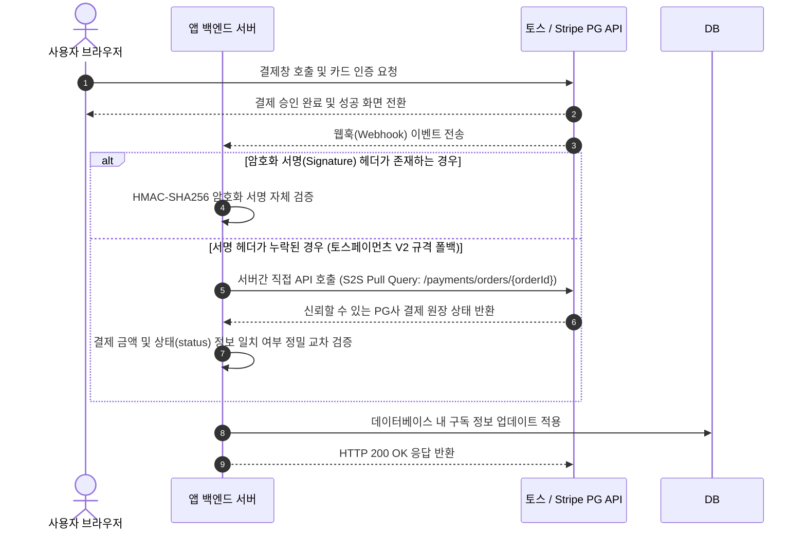
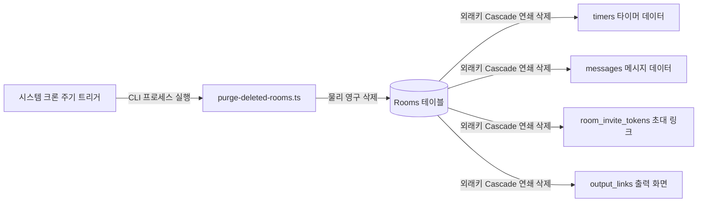

# SaaS 코어 엔진 설계서 (SaaS Core Engine Blueprint)
> **버전 1.0.0**  
> **대상**: 핵심 기능을 처음부터 다시 개발할 필요 없이, 몇 분 만에 새로운 웹 기반 SaaS 프로젝트를 시작할 수 있도록 돕는 범용 보일러플레이트 아키텍처 가이드입니다.

본 문서는 **QueTick(큐틱)** 프로젝트를 개발하며 구축한 검증되고 실전에 바로 투입 가능한 SaaS 아키텍처의 핵심 컴포넌트들을 정리한 것입니다. 안전한 사용자 인증 관리, 강력한 다중 PG 결제 연동, 엄격한 API 속도 제한(Rate-Limiting), 그리고 법적 규제 준수를 위한 법무 스캐폴딩이 필요한 모든 신규 SaaS 애플리케이션에서 즉시 복사하여 활용할 수 있도록 구조화되어 있습니다.

---

## 1. 아키텍처 개요 및 워크플로우

```mermaid
graph TD
    User([사용자 클라이언트]) --> |HTTPS / WSS| CDN[Cloudflare CDN & 보안 실드]
    CDN --> |프록시| Server[Next.js 앱 서버]
    
    subgraph SaaS 엔진 코어 (SaaS Engine Core)
        Server --> AuthManager[Supabase Auth 인증 관리자]
        Server --> RateLimiting[IP & 계정 기반 API 속도 제한기]
        Server --> BillingGate[이중 PG 웹훅 결제 관리자]
        Server --> SecurityGate[IP & 토큰 기반 패스워드 시도 가드]
    end
    
    AuthManager --> |토큰 및 권한 역할| DB[(Supabase PostgreSQL)]
    BillingGate --> |웹훅 V2 / S2S 검증| PG1[토스페이먼츠 API]
    BillingGate --> |웹훅 / 체크아웃| PG2[스트라이프 API]
    
    Server --> |커스텀 SMTP 인증| SES[AWS SES 이메일 인프라]
```

---

## 2. 사용자 인증 및 세션 관리 (Supabase Auth)

신규 SaaS의 사용자 전환율을 극대화하기 위해서는 간편한 소셜 로그인과 진입 장벽이 없는 익명 로그인 기능을 빈틈없이 결합하는 것이 필수적입니다.

### 핵심 기능
- **익명 세션 자동 생성**: 사용자가 별도의 가입 절차 없이 서비스를 즉시 체험할 수 있도록 `auth.users` 테이블 내에 익명 플래그(`is_anonymous = true`)를 가진 임시 사용자를 자동으로 생성합니다.
*   **소셜 OAuth 연동**: 구글, 카카오, 애플 등 단 한 번의 클릭으로 소셜 인증 프로필을 고유 UUID와 매핑하여 연동합니다.
- **동적 세션 복구 설계**: 네트워크 연결이 일시적으로 끊기더라도 사용자 세션이 안정적으로 유지되도록 IndexedDB를 폴백(Fallback) 저장소로 활용하여 복구 프로세스를 보장합니다.

### 데이터 모델 청사진
```sql
-- 익명 및 영구 회원을 통합 관리하고 SaaS 요금제 플랜을 매핑하는 구독 스키마
CREATE TABLE IF NOT EXISTS user_subscriptions (
    id UUID PRIMARY KEY DEFAULT gen_random_uuid(),
    user_id UUID NOT NULL REFERENCES auth.users(id) ON DELETE CASCADE,
    plan_id VARCHAR(50) NOT NULL DEFAULT 'free', -- 'free', 'pro', 'premium'
    status VARCHAR(30) NOT NULL DEFAULT 'inactive', -- 'active', 'inactive', 'canceled', 'refunded'
    current_period_end TIMESTAMP WITH TIME ZONE,
    updated_at TIMESTAMP WITH TIME ZONE DEFAULT timezone('utc'::text, now()) NOT NULL
);

CREATE UNIQUE INDEX IF NOT EXISTS idx_subscriptions_user ON user_subscriptions(user_id);
```

---

## 3. 고보안 이중 결제 엔진 (Toss Payments & Stripe)

국내 카드 및 간편결제 체계(**토스페이먼츠**)와 글로벌 결제 표준(**Stripe**)을 동시에 수용하며, 교차 서버 통증(S2S) 검증을 통해 웹훅 조작 공격을 물리적으로 원천 차단하는 하이브리드 결제 아키텍처입니다.



### 무서명 웹훅 서버 간 직접 교차 검증 (S2S Verification Pattern)
강력한 암호화 서명이 탑재되지 않은 웹훅 패킷이 수신되었을 때, 이를 그대로 믿지 않고 **백엔드가 직접 PG사 API로 확인 요청을 보내 원장을 비교**하는 방식으로 페이로드 위조 공격을 예방합니다.

```typescript
// 공통 결제 서버간 직접 API 조회 교차 검증 유틸리티 예시
export async function verifyWebhookPayload(
  orderId: string, 
  incomingAmount: number, 
  incomingStatus: string
): Promise<boolean> {
  try {
    // 1. PG사 인증 API 서버로 직접 보안 조회 요청 송신
    const response = await fetch(`https://api.tosspayments.com/v1/payments/orders/${orderId}`, {
      headers: {
        Authorization: `Basic ${Buffer.from(process.env.TOSS_SECRET_KEY + ':').toString('base64')}`,
      }
    });
    
    if (!response.ok) return false;
    const pgData = await response.json();
    
    // 2. 외부 송신 정보와 PG사 실시간 원장 데이터 간 완벽한 일치 여부 대조
    const isAmountValid = pgData.totalAmount === incomingAmount;
    const isStatusValid = pgData.status === incomingStatus;
    
    return isAmountValid && isStatusValid;
  } catch (error) {
    console.error("결제 웹훅 S2S 교차 검증 프로세스 오류 발생", error);
    return false;
  }
}
```

> [!IMPORTANT]
> PG사가 웹훅을 보냈으나 우리 서버의 네트워크 지연 등으로 교차 검증이 실패했을 경우에는 반드시 `HTTP 500 Internal Server Error`를 PG사 측에 반환해야 합니다. 이를 통해 PG사가 웹훅을 재전송(Retry)하도록 유도하여 결제 누락 건이 생기지 않도록 방지합니다.

---

## 4. API 속도 제한 및 비밀번호 브루트포스 차단 가드

서버의 연산 자원을 보호하고, 무차별 대입 공격(Brute-Force) 및 디도스성 침투를 방지하기 위한 엄격한 실전 보안 정책입니다.

### 4.1 슬라이딩 윈도우 기반 API 속도 제한 (`rate-limit.ts`)
메모리 점유율을 최소화하면서 효율적으로 IP별 요청 버킷을 추적·차단합니다.

| 엔드포인트 대상 | 차단 기준 스펙 | 제한 임계치 도달 시 액션 |
|---|---|---|
| **실시간 WebSocket 커넥션** | IP당 분당 120회 핸드셰이크 초과 시 | 소켓 즉시 강제 강등 및 연결 끊기 |
| **방 / 워크스페이스 생성** | IP당 분당 20회 (계정당 분당 10회) 초과 시 | `HTTP 429 Too Many Requests` |
| **AI 비서 처리 / 데이터 생성** | IP당 분당 10회 (계정당 분당 5회) 초과 시 | `HTTP 429 Too Many Requests` |

### 4.2 계정 실패 락아웃 및 실시간 카운트다운 게이트 (`auth-attempts.ts`)
비밀번호 보안 접속 주소를 탈취하려는 시도를 무력화하기 위해 IP와 토큰을 결합한 다중 보호막을 씌웁니다.

```
비밀번호 입력 오류 발생 (실패 이력 누적)
       │
       ▼
   IP 및 특정 토큰별 누적 실패 횟수 검사
       ├─── [동일 토큰에 대해 연속 5회 실패] ──→ 5분간 입력 제한 (HTTP 429)
       └─── [동일 IP 내 모든 시도 합산 15회 실패] ─→ 5분간 글로벌 IP 입력 차단 (HTTP 429)
```

- **반환 응답 헤더**: `Retry-After: 300` (재시도 가능한 잔여 시간을 초 단위로 전송)
*   **사용자 화면(UX) 동기화**: 잠금 상태가 감지되면, Password Gate UI가 실시간 초 단위로 타이머를 굴려 화면에 보여줍니다: *"과도한 로그인 시도 실패로 인해 04:59 동안 입력이 제한됩니다."*

---

## 5. 엔터프라이즈급 크론 배치 스크립트 (Cron Cleaners)

데이터베이스 성능을 최고의 상태로 유지하고, 외래키 관계가 꼬이지 않도록 Cascade 설계를 보장하는 자동화 스크립트 설계 가이드라인입니다.



### 배치 스크립트 작성 표준
1. **`--dry-run` 플래그 기본 제공**: 데이터 삭제를 수반하는 모든 배치 스크립트는 실제 연산을 수행하지 않고 지워질 대상 리스트만 보여주는 드라이런 모드를 필수로 내장해야 합니다.
2. **에러 발생 시 명시적 종료 코드 반환**: 네트워크 단절이나 데이터베이스 접속 장애 발생 시 반드시 콘솔에 예외를 출력하고 `exit 1`로 프로그램을 종료하여, 모니터링 시스템(PagerDuty, Datadog)에 연동된 경보가 정상 울리도록 해야 합니다.
3. **외래키 관계 기반의 연쇄 삭제(Cascade) 활용**: 애플리케이션 단에서 여러 테이블을 루프 돌며 지우는 대신 데이터베이스 엔진 고유의 `ON DELETE CASCADE` 룰을 적용해 원자적이고 일관된 데이터 파괴를 유도합니다.

---

## 6. AWS SES 커스텀 SMTP 이메일 연동 아키텍처

기본 호스팅의 공유 서버 IP를 사용할 때 발생하는 스팸 분류 및 메일 미도달 문제를 완전 해결하고 대규모 이메일을 안전하게 전송합니다.

### 메일 전달 신뢰성 3대 구성 요소
- **DKIM (DomainKeys Identified Mail)**: `quetick.io` 도메인이 보낸 메일임을 검증할 수 있도록 호스팅 도메인 DNS 상에 Amazon SES 지향 CNAME 레코드 3종을 매핑합니다.
- **DMARC (Domain-based Message Authentication)**: 타인의 메일 주소 위조 발송을 원천 차단하기 위해 표준 TXT 보안 규칙 레코드를 호스팅 네임서버에 주입합니다.
- **크리덴셜 기밀성 보장**: SMTP 전송을 위한 IAM 자격 증명 파일은 로컬 `.env.local` 환경 변수에만 보존하며, 실수로 Git 저장소에 커밋되지 않도록 `.gitignore` 규칙을 통해 완격 격리합니다.

---

## 7. 법무 및 약관 연동 컴플라이언스 템플릿

사용자에게 필수적으로 고지해야 하는 약관과 법률 의무 문서들을 컴포넌트 수준에서 손쉽게 갈아끼울 수 있도록 토큰화하여 설계했습니다.

```
┌────────────────────────────────────────────────────────┐
│                      src/lib/legal.ts                  │
│  - 서비스 이용약관 (Standard Terms)                     │
│  - 개인정보처리방침 규격 토큰                           │
│  - 환불 규정 및 이용료 정산 기준 세부 규격              │
└──────────────────────────┬─────────────────────────────┘
                           │
       ┌───────────────────┼───────────────────┐
       ▼                   ▼                   ▼
[terms/page.tsx]     [privacy/page.tsx]   [refund-policy/page.tsx]
```

### 메타데이터 토큰 매핑 가이드
새로운 SaaS 서비스에 이 약관 시스템을 이식하려면 오직 `src/lib/legal.ts` 하나의 파일만 수정하면 이용약관, 개인정보처리방침, 환불정책이 자동으로 치환됩니다.
- **`COMPANY_NAME`**: 정식 법인명 또는 개인 사업자 이름
- **`REPRESENTATIVE`**: 대표자 성명
- **`BUSINESS_NUMBER`**: 사업자등록번호
- **`PRIVACY_OFFICER`**: 임명된 개인정보 보호책임자 이름
- **`REFUND_WINDOW`**: 법적 청약철회 기간 (예: 7일)
